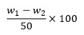

### Procedure
Step 1. Click on sand sample and Take 50g of base sand sample and mix it with 475ml distilled water, then add 25ml of NaOH solution to it.

Step 2. Click on container and take this mixture in a glass jar and put it in a mechanical stirrer then switch on the power.

Step 3. Set the timer for about 5 minutes, mix water up to 6-inch level, again click on stir for 2 minutes now allow sand particles are settled down at the bottom.

Step 4. Click on the siphon and take 5inch of unclean water from the glass jar.

Step 5. Repeat the process 3-4 till water becomes clear in the glass jar.

Step 6. Take the wet sand from the glass jar into a tray and put it into the oven at 110oC to remove moisture and weigh it. Using the following formula calculate the clay percentage in the sand.

Step 7. Percentage clay content is = 
				
Where	weight of sand w1 = 500gm 
W2 is the dried sand
